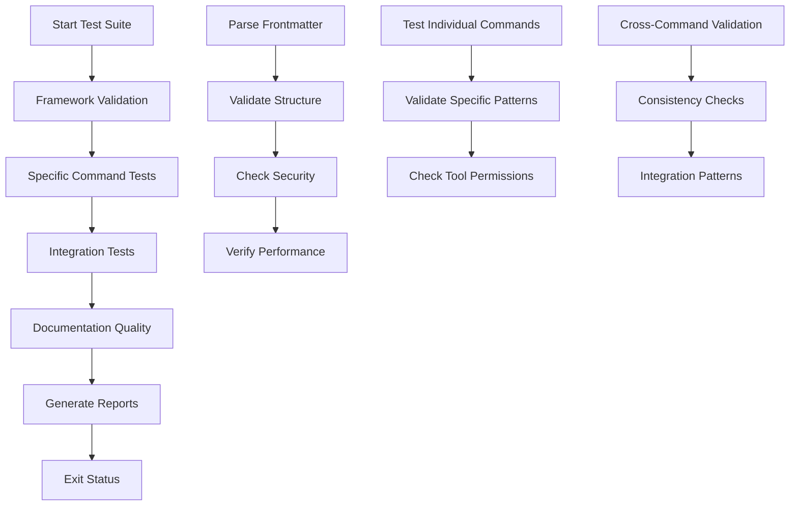

# Claude Code Commands Testing Framework

Comprehensive testing framework for validating Claude Code command prompts in the `.claude/commands` directory.

## Overview

This testing framework ensures that Claude Code commands are:
- ✅ **Structurally Valid**: Proper YAML frontmatter and required sections
- 🔒 **Security Compliant**: No hardcoded secrets or unsafe operations
- 🎯 **Functionally Correct**: Appropriate tools and execution patterns
- 📚 **Well Documented**: Clear descriptions and usage examples
- ⚡ **Performance Optimized**: Appropriate performance profiles

## Quick Start

```bash
# Run all tests
python tests/commands/run_tests.py

# Run with CI mode (exit codes for automation)
python tests/commands/run_tests.py --ci

# Generate specific report format
python tests/commands/run_tests.py --format json

# Test specific commands directory
python tests/commands/run_tests.py --commands-dir /custom/path/.claude/commands
```

## Test Categories

### 1. Framework Validation Tests (`test_framework.py`)

**Automated validation of command structure and compliance:**

- **Frontmatter Structure**: Validates YAML frontmatter syntax and required fields
- **Allowed Tools Syntax**: Checks tool declaration patterns and permissions
- **Command Structure**: Verifies required sections (Context, Task, etc.)
- **Security Patterns**: Detects hardcoded secrets and unsafe operations
- **Performance Considerations**: Validates performance profiles for wave-enabled commands
- **Documentation Quality**: Checks for examples, clear descriptions, adequate content

### 2. Specific Command Tests (`test_specific_commands.py`)

**Targeted tests for individual commands:**

- **Code Review Command**: Validates comprehensive checklist sections and review patterns
- **Git Commit Push**: Ensures proper git tool permissions and workflow patterns
- **Security Review**: Checks for security-specific terminology and patterns
- **Test Cases**: Validates testing tool permissions and test-related content
- **Update Docs**: Confirms documentation-related terminology and patterns
- **Fix Issue**: Verifies problem-solving terminology and debugging patterns
- **Rule Engine**: Checks for rule-related logic and pattern matching content

### 3. Integration Tests

**Cross-command consistency and interaction validation:**

- **Unique Command Names**: Ensures no duplicate command paths
- **Naming Conventions**: Validates consistent `/ck:` prefix and kebab-case naming
- **Wave-Performance Consistency**: Wave-enabled commands must specify performance profiles
- **Allowed Tools Consistency**: Common tools should have consistent declarations

### 4. Documentation Quality Tests

**Documentation standards and user experience:**

- **Clear Descriptions**: Meaningful descriptions with minimum length requirements
- **Usage Examples**: Code blocks, examples, or argument patterns
- **Completeness**: Adequate content length and structure

## Testing Methodology

### Test Severity Levels

| Level | Description | Action Required |
|-------|-------------|-----------------|
| 🔴 **CRITICAL** | Security vulnerabilities, missing essential structure | Must fix before merge |
| 🟠 **HIGH** | Functionality issues, missing required sections | Should fix before merge |  
| 🟡 **MEDIUM** | Quality issues, suboptimal patterns | Fix in current sprint |
| 🔵 **LOW** | Style issues, minor improvements | Nice to have |
| ℹ️ **INFO** | Informational, no action needed | For awareness |

### Test Execution Flow



### Automated Quality Gates

**Pre-merge Requirements:**
- ✅ Zero Critical issues
- ✅ Zero High priority issues
- ✅ All unit tests passing
- ✅ Documentation quality score ≥ 80%

**CI/CD Integration:**
```yaml
# Example GitHub Actions step
- name: Test Claude Commands
  run: python tests/commands/run_tests.py --ci --format json
  
- name: Upload Test Reports  
  uses: actions/upload-artifact@v3
  with:
    name: command-test-reports
    path: tests/commands/reports/
```

## Command Development Best Practices

### 1. Frontmatter Standards

```yaml
---
command: "/ck:command-name"
category: "Development & Implementation"
purpose: "Clear description of command objective"
wave-enabled: true
performance-profile: "optimization"
allowed-tools: Bash(find:*), Bash(git status:*), Read(*), Write(*), Edit(*)
---
```

**Required Fields:**
- `description` OR `purpose` - Clear command objective
- `allowed-tools` - If command uses bash operations

**Recommended Fields:**
- `command` - Command path (e.g., `/ck:code-review`)
- `category` - Logical grouping
- `wave-enabled` - For complex multi-step operations
- `performance-profile` - For wave-enabled commands

### 2. Content Structure

**Required Sections:**
```markdown
## Context
- Dynamic context gathering with !`command` patterns
- Project state information

## Task / Your task  
- Clear task description
- Specific objectives and requirements
```

**Best Practices:**
- Include usage examples with code blocks
- Use `$ARGUMENTS` for parameterized commands  
- Provide clear, actionable instructions
- Include error handling guidance

### 3. Security Guidelines

**❌ Never Include:**
- Hardcoded passwords, API keys, or tokens
- Unsafe operations like `rm -rf`, `sudo`, `eval`
- Unvalidated input processing
- Direct credential exposure

**✅ Always Include:**
- Input validation patterns
- Safe file operations (trash vs delete)
- Environment variable usage for secrets
- Permission checks and dry-run modes

### 4. Tool Permission Patterns

**Common Patterns:**
```yaml
allowed-tools:
  - Bash(find:*)         # File discovery
  - Bash(git status:*)   # Git operations
  - Bash(ls:*)          # Directory listing  
  - Read(*)             # File reading
  - Write(*)            # File writing
  - Edit(*)             # File editing
  - Glob(*)             # Pattern matching
  - Grep(*)             # Text search
```

**Specific Operations:**
```yaml
# Git operations
- Bash(git add:*)
- Bash(git commit:*)
- Bash(git push:*)

# Testing
- Bash(pytest:*)
- Bash(npm:*)
- Bash(yarn:*)

# Package management  
- Bash(pip:*)
- Bash(uv:*)
```

## Report Formats

### 1. Text Report
Human-readable summary with issue categorization:
```
# Claude Code Commands Test Report
==================================================
Total Tests: 45
✅ Passed: 42
❌ Failed: 3
⏭️ Skipped: 0

## 🔴 CRITICAL Issues (0 issues)
## 🟠 HIGH Issues (1 issues)
- frontmatter_structure_security-review.md: Missing required frontmatter fields
## 🟡 MEDIUM Issues (2 issues)
...
```

### 2. JSON Report
Machine-readable format for CI/CD integration:
```json
{
  "timestamp": "20241217_143022",
  "framework_tests": {
    "summary": {
      "total_tests": 45,
      "passed": 42,
      "failed": 3,
      "critical_issues": 0,
      "high_issues": 1
    },
    "results": [...]
  }
}
```

### 3. HTML Report
Visual dashboard with interactive elements:
- Color-coded test results
- Expandable issue details  
- File-specific summaries
- Trend analysis (if historical data available)

### 4. Summary Report (CI/CD)
Minimal format for build status:
```json
{
  "overall_status": "FAIL",
  "framework_tests": {"passed": 42, "failed": 3},
  "unit_tests": {"tests_run": 15, "failures": 0}
}
```

## Common Issues and Solutions

### Issue: "Missing YAML frontmatter"
**Solution:** Add proper frontmatter to command file:
```yaml
---
description: "Your command description"
allowed-tools: Bash(find:*), Read(*)
---
```

### Issue: "Invalid allowed-tools syntax"
**Solution:** Use correct tool patterns:
```yaml
# ✅ Correct
allowed-tools: Bash(git status:*)

# ❌ Incorrect  
allowed-tools: git status
```

### Issue: "Missing required sections"
**Solution:** Include Context and Task sections:
```markdown
## Context
- Current state: !`git status`

## Task
Perform the requested operation...
```

### Issue: "Security anti-patterns detected"
**Solution:** Remove hardcoded secrets:
```yaml
# ❌ Don't do this
API_KEY=sk-1234567890abcdef

# ✅ Do this instead
API_KEY=${API_KEY}
```

## Extension and Customization

### Adding Custom Tests

1. **Extend Framework Tests:**
```python
def _test_custom_validation(self, file_path: Path, content: str):
    """Add custom validation logic."""
    # Your custom test logic here
    pass
```

2. **Add Specific Command Tests:**
```python
def test_my_new_command(self):
    """Test for a new command."""
    file_path = self.commands_dir / "ck" / "my-new-command.md"
    # Test logic here
```

3. **Custom Report Formats:**
```python
def _generate_custom_report(self) -> str:
    """Generate custom report format."""
    # Custom report generation logic
    pass
```

### Configuration Options

**Environment Variables:**
- `CLAUDE_COMMANDS_DIR`: Override commands directory
- `TEST_OUTPUT_DIR`: Override report output directory
- `TEST_VERBOSITY`: Control test output verbosity

**Command Line Options:**
```bash
--commands-dir PATH    # Custom commands directory
--output-dir PATH      # Custom output directory  
--format FORMAT        # Report format (text/json/html/all)
--ci                   # CI mode with exit codes
--verbose              # Increase output verbosity
```

## Continuous Improvement

### Metrics Tracking
- Test coverage across command categories
- Issue detection rates by severity
- Performance of validation rules
- False positive/negative rates

### Regular Maintenance
- Update validation patterns for new command types
- Enhance security pattern detection
- Improve report formatting and usability
- Add integration with development workflows

This testing framework ensures high-quality, secure, and maintainable Claude Code commands that follow consistent patterns and best practices! 🎯